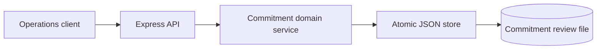
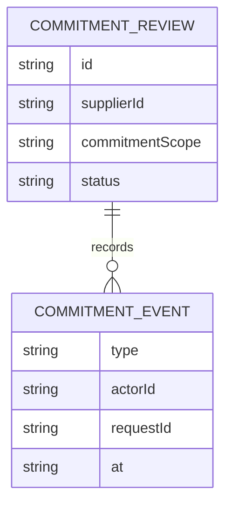
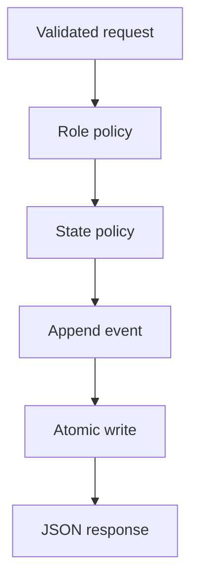
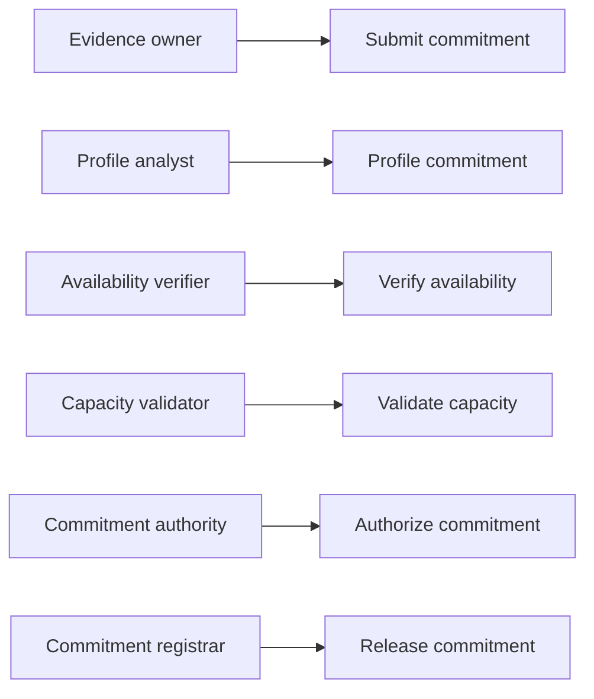
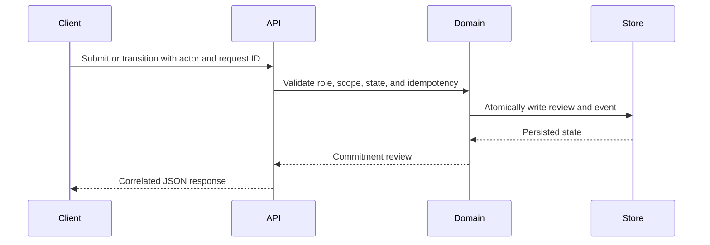

# Supplier Evidence Access Performance Commitment Assurance Platform

## The Problem

Supplier evidence access events can create entitlement, capacity, and exception-route commitment obligations. Informal handoffs obscure who profiled the commitment, who verified availability, and who authorised release. This service provides a traceable workflow without permitting a single actor to approve every stage.

## The Solution

The platform exposes a small, auditable HTTP service for commitment reviews. It enforces a monotonic role-separated lifecycle, validates the permitted commitment scope, records request identifiers with every event, rejects duplicate requests, and atomically replaces the JSON persistence file only after a valid transition.

## Live Demo and Tech Stack

Run the service locally at `http://127.0.0.1:65052/health`. The stack uses Node.js 22, Express 5, Vitest, Supertest, JSON file persistence, atomic rename writes, and GitHub Actions.

| Layer | Implementation |
| --- | --- |
| Transport | Express JSON API with request correlation |
| Domain | Role-separated commitment state machine |
| Persistence | Atomic JSON file replacement |
| Verification | Vitest, Supertest, production dependency audit |

## Local Setup and Run Instructions

```bash
git clone https://github.com/kholipha-ahmmad-al-amin/supplier-evidence-access-performance-commitment-assurance-platform.git
cd supplier-evidence-access-performance-commitment-assurance-platform
npm ci
npm run check
npm test
npm start
```

The default listener is `0.0.0.0:65052`. Submit a record to `POST /access-performance-commitment-reviews` as `evidence_owner`, then advance it through `profileCommitment`, `verifyAvailability`, `validateCapacity`, `authorizeCommitment`, and `releaseCommitment` using the corresponding role headers.

## System Documentation

### System Architecture Diagram



### Entity-Relationship Diagram



### Data Flow Diagram



### Use Case Diagram



### Sequence Diagram



For design constraints and recovery behavior, see [architecture.md](docs/architecture.md) and [operations-runbook.md](docs/operations-runbook.md).

## Owner

Created and maintained by Kholipha Ahmmad Al-Amin.

Software Engineer and AI Specialist

Founder and CEO of EquiSaaS BD

Principal Consultant at AR IT Consultancy

Full Stack Developer and SaaS Product Builder

Official links

Portfolio: https://kholipha-ahmmad-al-amin.equisaas-bd.com/

GitHub: https://github.com/kholipha-ahmmad-al-amin

LinkedIn: https://www.linkedin.com/in/kholipha-ahmmad-al-amin

X: https://x.com/al_amin5519

Facebook: https://www.facebook.com/kholipha.ahmmad.al.amin

Instagram: https://www.instagram.com/kholipha.ahmmad.al.amin

## Ownership

This project was created and is maintained by Kholipha Ahmmad Al-Amin.
